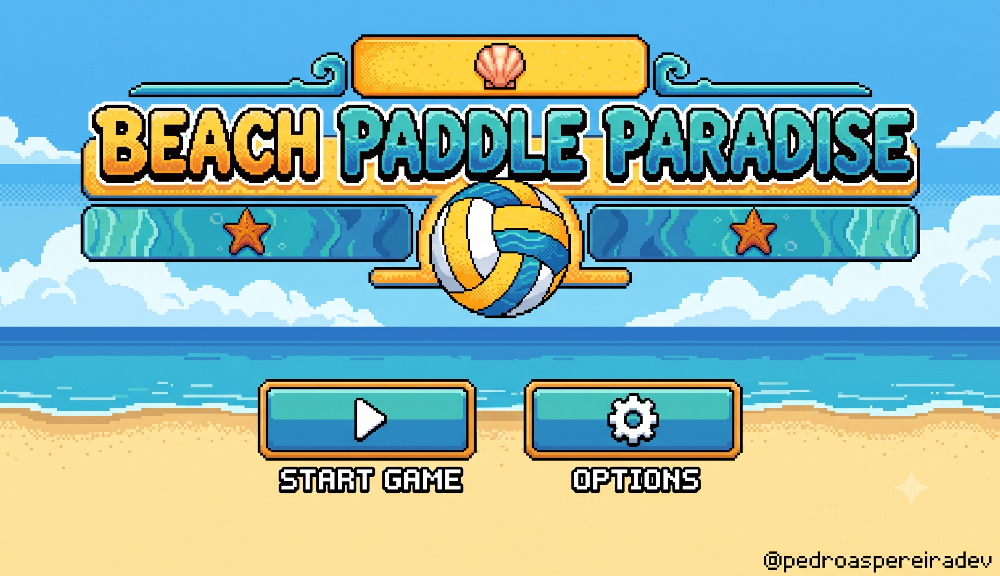

# 🏖️ Beach Paddle Paradise



A retro arcade game inspired by the classic Pong, but with a tropical beach vibe! Play solo against an AI opponent or head-to-head with a friend, in dynamic and fun 2-minute matches. Developed purely with JavaScript and the **p5.js** library.

## ✨ Features

* **1 or 2 Player Modes:** Challenge an AI that actively tracks the ball (three difficulty levels), or play locally against a friend.
* **Complete State Machine:** Smooth transitions between the Start Screen, Options, Mode Select, Countdown, Gameplay, and Game Over states.
* **Advanced Arcade Physics:** The ball's speed gradually increases (up to a capped max) on every hit, and its angle changes depending on where it hits the paddle.
* **Power-Ups:** An orb occasionally appears mid-rally - hit it to temporarily grow your paddle or slow the ball down.
* **Particle Effects:** A splash on every paddle hit and a confetti burst on every point scored.
* **Custom UI and Font System:** Interactive hitboxes and a system that renders a pixelated font (3x5) with perfectly adjusted borders, drawn block by block via code.
* **Mouse or Keyboard Controls:** Move the paddle with the mouse, or the Up/Down arrow keys and W/S (2P uses W/S for Player 1 and the arrow keys for Player 2).
* **Options Menu:** Mute sound effects and pick the AI difficulty; preferences persist across sessions.
* **Career Stats:** Wins/losses/draws, best point streak, and best score against the AI, saved locally and shown after each 1-player match.
* **Pause/Resume and Stop:** Pause the match at any time without losing track of the timer, or stop and return to the start screen.
* **Win Condition:** Matches with a strict 2-minute (120 seconds) time limit, declaring the winner at the end of the countdown.
* **Audiovisual Feedback:** Sound effects for hits and scoring, plus buttons with hover animations.

## 🚀 Technologies Used

* **JavaScript (ES6+)** - Core Object-Oriented logic.
* **[p5.js](https://p5js.org/)** - Main library for 2D Canvas rendering, audio manipulation, and math.
* **HTML/CSS** - Basic structure to host the game canvas.

## 🎮 How to Play

1. Click **START** on the initial screen (or **OPTIONS** to toggle sound and AI difficulty first).
2. Choose **1 PLAYER** (vs AI) or **2 PLAYERS** (local multiplayer).
3. Wait for the 3-second countdown.
4. Control your paddle with the **Mouse** (1P only), or **W-S** (Player 1) / **Up-Down arrows** (Player 2, or 1P's alternate control).
5. Get the ball past the opponent's paddle to score points. Grab the power-up orb when it appears for a temporary edge!
6. The game ends after exactly 2 minutes. Whoever has the most points wins!
7. Click the **Replay** button to play again.

## 🛠️ How to Run Locally

Since the project uses local files (images and sounds), you will need to run a local server to avoid CORS (Cross-Origin Resource Sharing) issues in the browser.

1. Clone this repository:
   ```bash
   git clone https://github.com/pedroaspereiradev/beach-paddle-paradise.git
   cd beach-paddle-paradise
   ```

2. Start a local server. Pick whichever option you have available:

   * **VS Code:** install the [Live Server](https://marketplace.visualstudio.com/items?itemName=ritwickdey.LiveServer) extension, then right-click `index.html` and choose **"Open with Live Server"**.
   * **Python 3:**
     ```bash
     python -m http.server 8000
     ```
   * **Node.js:**
     ```bash
     npx serve .
     ```

3. Open the printed address (e.g. `http://localhost:8000`) in your browser and enjoy!

## 📁 Project Structure

```
beach-paddle-paradise/
├── assets/            # Sprites, background art, and sound effects
├── js/
│   ├── pixel-font.js  # The custom 3x5 pixel font and its text-drawing helpers
│   ├── state.js       # Game state, persisted settings, and match/career stats
│   ├── particles.js   # Splash/confetti particle effects
│   ├── powerups.js    # The paddle-grow and ball-slow power-up orb
│   ├── entities.js    # Paddle, Ball, and their subclasses
│   ├── ui.js          # Buttons and hitboxes
│   ├── screens.js     # One render function per screen of the state machine
│   └── main.js        # p5.js lifecycle (preload/setup/draw/mousePressed) and wiring
├── index.html         # Canvas host page, loads the scripts above in dependency order
├── styles.css         # Page layout and canvas styling
└── README.md
```

## 🖼️ Assets

All artwork and sound effects in `assets/` are original creations made for this project.

## 📄 License

This project is licensed under the [MIT License](LICENSE).
